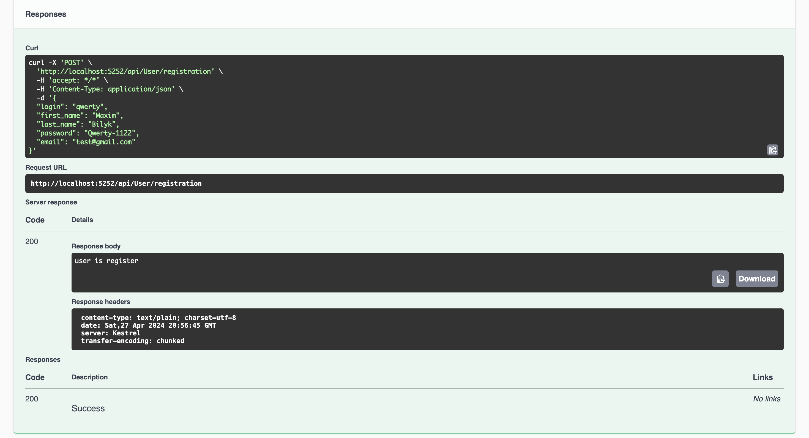

# Тестування працездатності системи

Тестування системи відбувалося за допомогою Swagger

## Реєстрація користувача

### Початкове вікно реєстрації

### Введення даних

### Помилка(робота валідації) 

Так само працює для поля email

### Успішна реєстрація

## Авторизація користувача

### Початкове вікно авторизації

### Введення даних

### Помилка

### Успішна авторизація

## Вигляд даних у базі даних 
